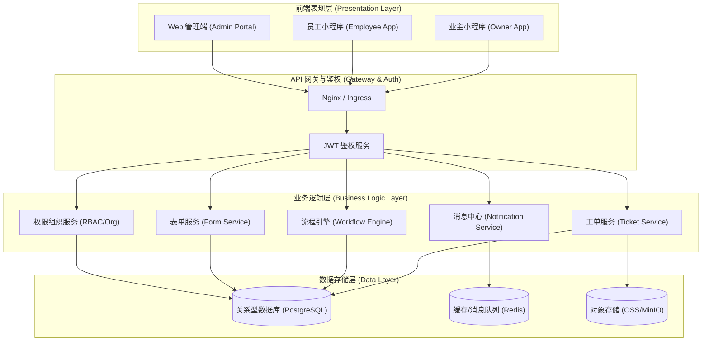
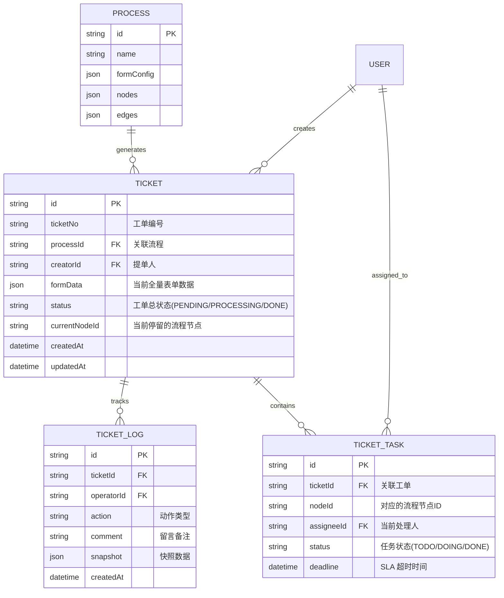

# 工单系统多端协作平台技术架构文档

## 1. 系统架构概览

本项目采用典型的前后端分离架构，通过 RESTful API 和 WebSocket（消息推送）进行通信。系统分为三大前端（业主小程序、员工小程序、Web 管理端）和一个统一的后端服务（流程引擎 + 业务中心）。



## 2. 技术栈选型

- **Web 管理端**：
  - 框架：React 18 + TypeScript + Vite
  - 样式：Tailwind CSS
  - 流程画布：`@xyflow/react`
  - 状态管理：Zustand / React Context
  - 数据请求：Axios / SWR
  - 组件库：Radix UI / Shadcn (推荐) 或自有业务组件
- **小程序端（业主/员工）**：
  - 框架：Taro 或 uni-app (React/Vue 语法编译为多端)
  - UI 框架：Taro UI / NutUI
- **后端服务**：
  - 框架：Node.js (Express / NestJS) 或 Go / Java
  - ORM：Prisma
  - 数据库：PostgreSQL
  - 缓存：Redis (用于限流、SLA 定时任务、消息队列)

## 3. 核心路由与接口设计 (Web端)

### 3.1 页面路由表
| 路由路径 | 页面描述 | 权限要求 |
| --- | --- | --- |
| `/login` | 登录页 | 公开 |
| `/dashboard` | 全局数据概览/工作台 | 登录用户 |
| `/tickets` | 全局工单台账 | 管理员/客服 |
| `/tickets/:id` | 工单详情页 (管理视角) | 管理员/客服/对应处理人 |
| `/dispatch` | 调度中心 (待派单池) | 客服/调度员 |
| `/processes` | 流程中心列表 (已实现) | 系统管理员 |
| `/processes/:id/edit` | 流程编辑器 (已实现) | 系统管理员 |
| `/services` | 服务目录管理 | 运营/管理员 |

### 3.2 核心 API 结构设计 (工单运行态)

#### 3.2.1 发起工单 (业主端)
```typescript
// POST /api/tickets
interface CreateTicketDto {
  processId: string;       // 关联的流程模板 ID
  formData: Record<string, any>; // 用户填写的动态表单数据
  communityId: string;     // 提单所在小区
}

// Response
interface TicketResponse {
  id: string;
  ticketNo: string;        // 生成的易读工单号 (如 WO-20260420-001)
  status: 'PENDING' | 'PROCESSING' | 'COMPLETED' | 'CLOSED';
  currentNodeId: string;   // 当前停留的流程节点 ID
}
```

#### 3.2.2 获取工单详情与动态表单 (处理端)
```typescript
// GET /api/tickets/:id
interface TicketDetail {
  id: string;
  processInfo: { name: string, timeLimit: number };
  creator: { id: string, name: string, phone: string };
  currentNode: {
    id: string;
    type: 'taskNode' | 'approvalNode' | 'evaluateNode';
    name: string;
    // 核心：当前处理人对表单各字段的权限矩阵 (来源于流程配置)
    fieldPermissions: Record<string, 'editable' | 'readonly' | 'hidden'>;
  };
  formData: Record<string, any>; // 全量表单数据
  timeline: Array<{
    action: string;        // 动作 (如 CREATE, ACCEPT, APPROVE, TRANSFER)
    operatorName: string;
    timestamp: string;
    comment?: string;
  }>;
}
```

#### 3.2.3 提交处理节点 (流转)
```typescript
// POST /api/tickets/:id/advance
interface AdvanceTicketDto {
  action: 'SUBMIT' | 'APPROVE' | 'REJECT' | 'TRANSFER';
  targetNodeId?: string;   // 某些情况下的手动流转目标
  updatedFormData?: Record<string, any>; // 员工补充的表单数据 (如耗材)
  comment?: string;        // 处理意见
  attachments?: string[];  // 现场照片
}
```

## 4. 核心数据模型 (Prisma)

以下是支撑运行态的核心数据表设计补充（在现有 Process 表基础之上）：

