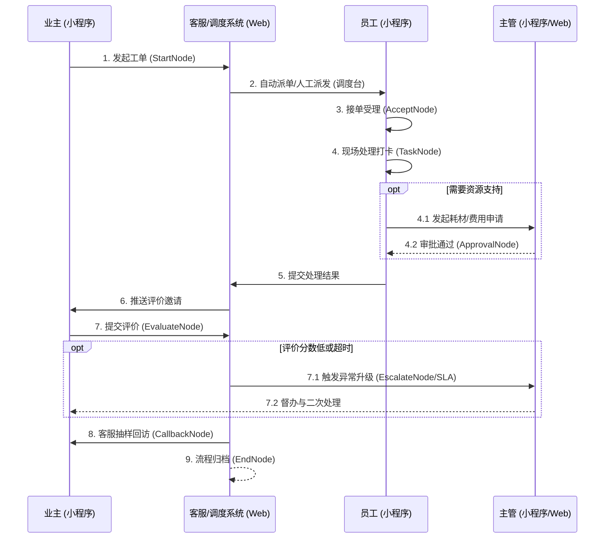

# 工单系统多端协作平台 PRD

## 1. 产品概述
本项目旨在构建一个基于流程引擎驱动的企业级工单系统，连接社区业主、一线处理员工和后台管理人员。通过业主小程序端实现极简报修与评价，员工小程序端实现移动抢单与现场打卡，Web 管理端实现全局配置调度与数据监控，从而形成工单服务的标准化闭环。

## 2. 目标用户与角色
- **业主 (Owner)**：通过业主小程序端发起报修/投诉，跟踪进度并进行服务评价。
- **一线员工 (Employee/Agent)**：通过员工处理小程序端接收派单，前往现场处理、拍照打卡并提交结果。
- **基层主管 (Supervisor)**：通过员工小程序端进行移动审批（如耗材报销、工单延期）。
- **客服/调度员 (Dispatcher)**：通过 Web 端统筹新进工单，进行人工派单、催办、异常干预和电话回访。
- **系统管理员 (Admin)**：通过 Web 端配置流程规则、表单模板和节点权限。

## 3. 核心功能与页面结构 (详细分解)

### 3.1 业主小程序端 (To C)
**目标**：提单、查询进度、补充材料、评价闭环。

| 页面模块 | 功能点详情 |
| --- | --- |
| **登录/绑定页** | - 手机号登录/微信授权登录 - 绑定小区/房屋/业主身份（选择小区-楼栋-房号） - 个人信息维护（手机号、姓名） |
| **首页 / 服务大厅** | - 展示“可提单的服务项”（来自流程中心启用的流程，按适用小区过滤） - 服务分类/搜索（报修、投诉、咨询…） - 常用服务快捷入口、公告/通知入口 |
| **提单页 (动态表单)** | - 选择服务后渲染该流程的发起表单（来自 FormBuilder） - 字段校验、必填提示、默认值 - 图片/视频/附件上传、定位/地址选择 - 提交工单、生成工单号 - 提交后跳转详情页 |
| **我的工单列表** | - 状态筛选：待受理/处理中/待评价/已完成/已关闭 - 搜索（工单号/关键词）、时间筛选 - 列表卡片展示：标题、状态、更新时间、当前进度简述 |
| **工单详情页 (业主视角)**| - 工单基础信息：编号、类型、状态、提交时间、地址 - 表单内容只读展示（按业主可见字段） - 处理进度时间轴（对外简化版：已提交→已受理→处理中→已完成） - 追加信息/补充材料（按流程配置允许时） - 撤销/取消（未受理前或符合规则时） - 在线沟通（留言/客服入口，可选） |
| **评价页** | - 星级评分、标签（响应速度/服务态度/解决质量） - 文字评价、图片上传 - 提交后回写到工单，并触发低分升级（如有） |
| **消息中心** | - 工单状态变化通知：受理、派单、完结、待评价提醒 - 系统公告、物业通知 - 未读角标、消息详情 |
| **个人中心** | - 我的房屋/小区切换 - 联系方式、隐私设置 - 客服电话/在线客服、意见反馈 |

### 3.2 员工处理小程序 (To B 一线)
**目标**：移动接单、现场处理、拍照回传、审批、关单。

| 页面模块 | 功能点详情 |
| --- | --- |
| **登录页** | - 账号/手机号登录 - 角色识别（维修/客服/主管）、所属组织/小区绑定 |
| **工作台 (首页)** | - 待办数量、超时预警数量 - 快捷入口：待接单、处理中、待我审批、巡检/打卡（可选） |
| **待接单列表 (抢单/派单)**| - 列表筛选：小区/类型/紧急程度/距离（可选） - 接单/拒单（拒单原因） - 查看工单简要信息 |
| **我的待办列表 (处理中)**| - 当前节点任务列表（受理/处理/回访/升级等） - 状态、剩余 SLA、优先级标识 - 搜索、筛选、排序（按超时、按创建时间） |
| **工单处理详情页 (员工视角)**| - 工单基本信息、地图导航/一键拨号 - 动态表单渲染：按“当前节点表单权限”控制可见/可编辑/只读 - 处理动作按钮（根据节点类型显示）：开始处理/提交结果/转派/退回/挂起/完结 - 上传现场照片/视频、录入耗材、工时、处理说明 - 现场打卡（定位+时间+拍照，可选） - 内部备注/协作留言（可选） |
| **审批列表 (主管/多级)** | - 待我审批/已审批 - 审批操作：同意/拒绝/退回，填写意见 - 审批附件查看、金额/耗材明细查看 |
| **异常/升级处理列表** | - 低分升级、超时升级任务 - 督办处理、二次处理反馈 |
| **消息中心** | - 派单通知、催办、审批提醒、超时预警 - 已读/未读管理 |
| **个人中心** | - 个人信息、所属组织/小区 - 工作状态（在线/忙碌/离线，可选） - 设置、意见反馈 |

### 3.3 Web 端 (管理/调度/配置)
**目标**：流程配置、全局台账、调度干预、组织权限、报表。

| 页面模块 | 功能点详情 |
| --- | --- |
| **登录页 / 权限与账号体系** | - 账号登录、角色权限（管理员/客服/主管/运营） - 组织架构与数据权限（按小区/项目） |
| **流程中心 (已实现基础)** | - 流程列表：查询、启停、复制、删除、版本查看 - 流程编辑器：基础信息、表单配置、节点配置（含条件、多分支、节点属性、表单权限） |
| **服务目录管理** | - 将流程“发布”为服务项：图标、名称、说明、适用小区、开放时间 - 上下线、排序、可见范围（某些楼栋/房屋类型） |
| **工单台账 (全局列表)** | - 多维筛选：小区/流程类型/状态/节点/处理人/时间/SLA - 导出、批量操作（分配/催办/关闭） - 列表字段自定义（可选） |
| **工单详情 (管理视角)** | - 全量信息查看（含内部字段、所有节点表单数据） - 流转时间轴/日志（谁在何时做了什么） - 强制干预：改派、加签、退回、挂起/恢复、作废、强制结单 - 内部协作：备注、附件、@提醒（可选） |
| **调度台 (客服/派单中心)** | - 待受理池、待派单池 - 自动派单规则（按小区/工种/班组/负载） - 手动派单/改派、转派原因 |
| **SLA 监控与预警** | - 超时/即将超时列表 - 红黄绿预警、升级策略触发记录 - 督办、催办、通知发送 |
| **评价与回访中心** | - 待回访列表、回访记录录入 - 差评工单池（升级处理闭环） - 评价统计（满意度趋势、差评原因） |
| **组织与权限 (基础数据)** | - 小区/项目管理、楼栋房屋数据（或对接） - 人员/角色/班组、技能标签、值班排班（可选） - 数据权限控制（按小区/项目/部门） |
| **消息与模板中心** | - 站内信/短信/企微/钉钉模板管理 - 通知触发规则（派单、超时、完结、评价提醒） |
| **统计报表 (BI)** | - 工单量、完结率、平均响应/解决时长、SLA 达标率 - 人员绩效：处理量、超时数、差评率 - 项目维度对比、导出 |

## 4. 核心业务流程

## 5. UI/UX 设计方向
- **整体风格 (Aesthetic)**：现代工业/实用主义 (Industrial/Utilitarian)。强调界面的清晰度、信息密度和操作效率，减少不必要的装饰。
- **主题色**：主色调使用深沉的工业蓝 (Slate Blue) 或效率绿 (Emerald)，辅以高对比度的状态色（红-超时/异常，黄-处理中，绿-已完结）。
- **字体排版**：使用易读性极高的无衬线字体（如 Inter 或系统默认字体）。数据展示采用等宽数字字体对齐。
- **业主端体验**：极致精简，大按钮，表单分组分页，步骤条清晰。
- **员工端体验**：大面积触控热区（方便户外作业操作），醒目的状态标签和倒计时，支持手势滑动切换工单。
- **Web 端体验**：高密度数据表格，支持抽屉式详情滑出，支持丰富的快捷键操作，复杂的流程编排采用沉浸式全屏画布。