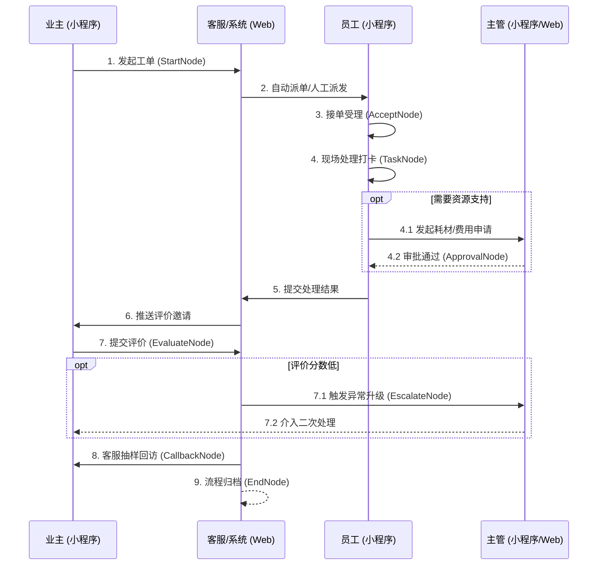

# 工单系统多端协作平台 PRD

## 1. 产品概述
本项目旨在构建一个基于流程引擎驱动的企业级工单系统，连接社区业主、一线处理员工和后台管理人员。通过业主小程序端实现极简报修与评价，员工小程序端实现移动抢单与现场打卡，Web 管理端实现全局配置调度与数据监控，从而形成工单服务的标准化闭环。

## 2. 目标用户与角色
- **业主 (Owner)**：通过业主小程序端发起报修/投诉，跟踪进度并进行服务评价。
- **一线员工 (Employee/Agent)**：通过员工处理小程序端接收派单，前往现场处理、拍照打卡并提交结果。
- **基层主管 (Supervisor)**：通过员工小程序端进行移动审批（如耗材报销、工单延期）。
- **客服/调度员 (Dispatcher)**：通过 Web 端统筹新进工单，进行人工派单、催办、异常干预和电话回访。
- **系统管理员 (Admin)**：通过 Web 端配置流程规则、表单模板和节点权限。

## 3. 核心功能与页面结构

### 3.1 业主小程序端 (Owner Mini Program)
*定位：服务发起与反馈的 C 端轻量化入口。*

| 页面名称 | 核心功能描述 | 关联流程节点 |
| --- | --- | --- |
| **服务大厅 (首页)** | 展示当前启用的服务目录（如居家维修、公共报修）。点击进入对应表单。 | 无 |
| **发起工单页** | 动态渲染对应流程的业务表单（支持文本、定位、拍照上传）。 | `StartNode` (发起节点) |
| **我的工单列表** | 按状态（待处理、处理中、待评价、已完成）展示历史工单卡片。 | 无 |
| **工单进度详情页** | 展示工单基础信息，只读显示提交的表单数据，并以时间轴展示关键节点进度。 | 无 |
| **服务评价页** | 工单流转至待评价状态时，业主可进行星级打分和文字留言。 | `EvaluateNode` (评价节点) |

### 3.2 员工处理小程序 (Employee Mini Program)
*定位：一线人员的移动作业与协作工具。*

| 页面名称 | 核心功能描述 | 关联流程节点 |
| --- | --- | --- |
| **工作台 (首页)** | 待办数量角标，快捷入口（抢单池、我的待办、待我审批）。 | 无 |
| **待办/抢单列表** | 列表形式展示分配给当前人员或班组的工单，支持按距离或紧急度排序。 | 无 |
| **工单处理详情页** | 核心干活页面。根据节点权限动态渲染表单（如只允许填“耗材费”）。支持点击操作按钮（如接单、转派、提交处理结果、拍照打卡）。 | `AcceptNode` (受理), `TaskNode` (处理) |
| **移动审批页** | 基层主管在此页面查看员工提交的特殊申请（如费用报销），并进行同意或驳回操作。 | `ApprovalNode` (审批节点) |

### 3.3 Web 管理端 (Web Admin)
*定位：配置大脑、调度中枢与数据监控塔。*

| 页面名称 | 核心功能描述 | 关联流程节点 |
| --- | --- | --- |
| **流程中心** | (已完成) 流程模板的增删改查，配置表单字段、节点流转规则及表单权限。 | 所有底层节点配置 |
| **服务目录管理** | 控制流程模板在业主端的上架、下架、展示图标及排序。 | 无 |
| **全局工单台账** | 列表视图检索全量工单，支持多维条件筛选、数据导出。 | 无 |
| **工单详情(管理视角)** | 查看工单全量字段和详细流转日志，支持强制改派、挂起、作废等管理员越权操作。 | 所有节点 |
| **客服回访工作台** | 针对已完结工单进行电话回访，并记录真实评价（防刷单机制）。 | `CallbackNode` (回访节点) |
| **SLA与异常督办大盘** | 红绿灯展示超时工单；专门展示业主低分评价的工单，供管理层发牌督办。 | `EscalateNode` (升级节点) |
| **统计报表 (BI)** | 统计各小区单量、解决率、平均耗时、员工绩效排名及客户满意度趋势。 | 无 |

## 4. 核心业务流程

## 5. UI/UX 设计方向
- **整体风格 (Aesthetic)**：现代工业/实用主义 (Industrial/Utilitarian)。强调界面的清晰度、信息密度和操作效率，减少不必要的装饰。
- **主题色**：主色调使用深沉的工业蓝 (Slate Blue) 或效率绿 (Emerald)，辅以高对比度的状态色（红-超时/异常，黄-处理中，绿-已完结）。
- **字体排版**：使用易读性极高的无衬线字体（如 Inter 或系统默认字体）。数据展示采用等宽数字字体对齐。
- **业主端体验**：极致精简，大按钮，表单分组分页，步骤条清晰。
- **员工端体验**：大面积触控热区（方便户外作业操作），醒目的状态标签和倒计时，支持手势滑动切换工单。
- **Web 端体验**：高密度数据表格，支持抽屉式详情滑出，支持丰富的快捷键操作，复杂的流程编排采用沉浸式全屏画布。