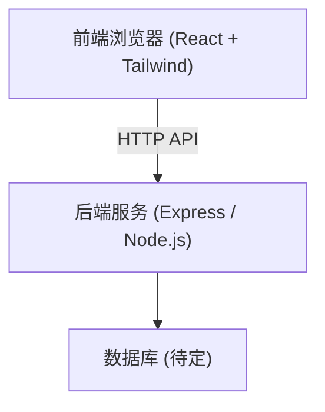
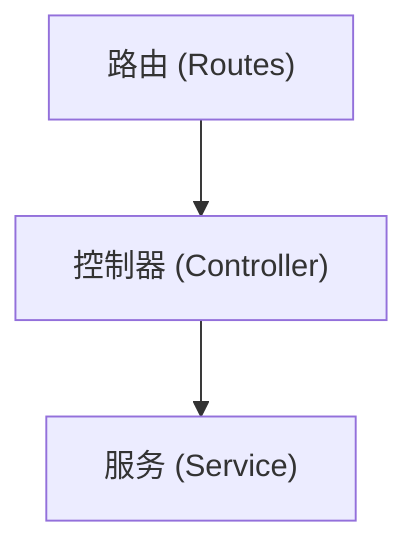

## 1. 架构设计

## 2. 技术说明
- 前端框架: React@18 + Vite
- 样式方案: Tailwind CSS @3 + Lucide React (图标)
- 目录结构: 根目录下创建 `frontend` 和 `backend` 文件夹。
- 初始化方式: 分别使用 Vite 和 npm init 初始化。
- *注：本次任务仅完成前端页面复刻，后端仅搭建基础空目录结构。*

## 3. 路由定义
| 路由 | 用途 |
|-------|---------|
| / | 登录页面，默认展示手机号登录模块 |

## 4. API 定义
*(后端功能暂不实现，仅做预留)*
- `POST /api/auth/send-code`: 发送验证码
- `POST /api/auth/login`: 手机号/邮箱登录

## 5. 服务器架构图

## 6. 数据模型
*(暂不实现)*
