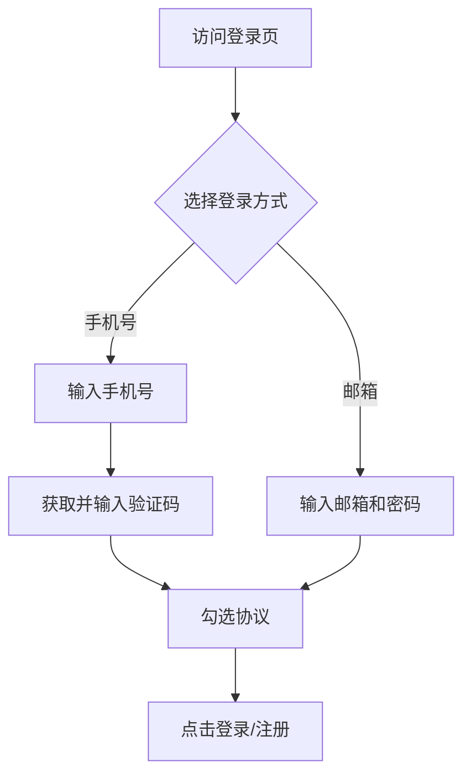

## 1. 产品概述
复刻腾讯Ardot（https://ardot.tencent.com/drive/login）的登录页面。
- 提供极简、现代化的用户登录界面。
- 包含手机号登录（带验证码）和邮箱登录的切换。

## 2. 核心功能

### 2.1 用户角色
| 角色 | 注册方式 | 核心权限 |
|------|---------------------|------------------|
| 普通用户 | 手机号验证码或邮箱注册 | 登录系统，使用基础功能 |

### 2.2 功能模块
1. **登录页**: 手机号输入、验证码获取、登录按钮、协议勾选、其他登录方式切换。

### 2.3 页面详情
| 页面名称 | 模块名称 | 功能描述 |
|-----------|-------------|---------------------|
| 登录页 | 手机号登录模块 | 输入手机号，获取验证码，勾选协议并点击登录。 |
| 登录页 | 邮箱登录模块 | 切换至邮箱登录（展示邮箱和密码输入框）。 |
| 登录页 | 协议与底栏 | 展示《用户服务协议》与《隐私政策》链接及其他登录入口。 |

## 3. 核心流程
用户访问登录页，默认展示手机号登录。用户输入手机号，点击获取验证码，填写验证码并勾选同意协议，点击登录。也可切换至邮箱登录方式。

## 4. 用户界面设计
### 4.1 设计风格
- 极简、留白充足。
- 核心色：绿色（用于协议链接高亮），灰色（未激活按钮、输入框背景）、黑色（主要文字）。
- 输入框与按钮风格：大圆角（pill shape），浅灰色无边框背景。
- 字体：系统默认无衬线字体，现代感。

### 4.2 页面设计概览
| 页面名称 | 模块名称 | UI 元素 |
|-----------|-------------|-------------|
| 登录页 | 标题 | "手机号登录" 或 "邮箱登录"，大字号居中。 |
| 登录页 | 表单区 | 手机号输入框（浅灰背景，全圆角），验证码输入框（内部右侧带获取验证码按钮，中间带分割线）。 |
| 登录页 | 提交按钮 | 全宽大圆角按钮，未激活为灰色，激活后可设为主色调。 |
| 登录页 | 协议栏 | 居中小字号，复选框 + 灰色文本 + 绿色协议链接。 |
| 登录页 | 其他登录方式 | 带线性的文字分割线 "其他登录方式"，下方排列邮箱或手机图标。 |

### 4.3 响应式
桌面端优先，居中显示在屏幕中间；移动端适配，表单宽度占满屏幕并留出安全边距。
